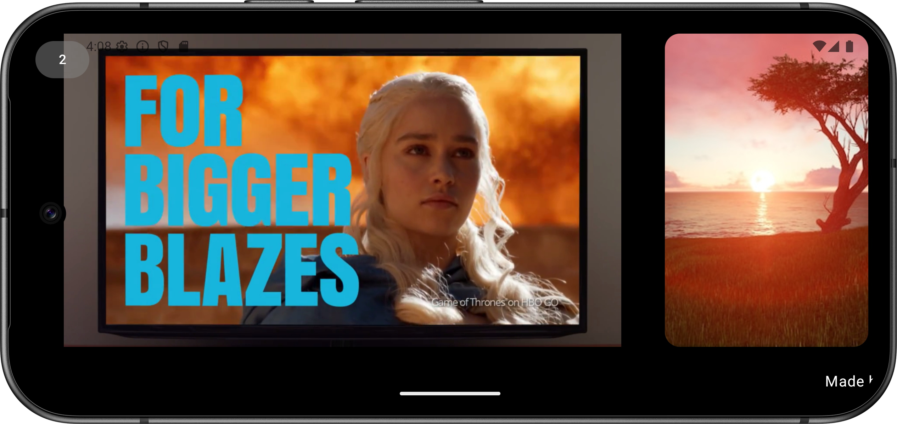

# Firas Ghaoui

### Hello, I am an android developer, always follow best practices for android application and I am always ready to learn new technologies, methods, and principle as per the project requirements. Keep Learning and Keep Sharing

&nbsp;&nbsp;&nbsp;&nbsp;&nbsp;&nbsp;

# ShopMyInfluens App

Are you an influencer? Would you like to share your style, favorites and desires? Would you like to be inspired by the favorite worlds of other influencers and get in touch with them? Download the Shop My Influence application and become part of a large network of influencers.

&nbsp;&nbsp;&nbsp;&nbsp;&nbsp;
  &nbsp;&nbsp;&nbsp;&nbsp;&nbsp;
    &nbsp;&nbsp;&nbsp;&nbsp;&nbsp; 
  &nbsp;&nbsp;&nbsp;&nbsp;&nbsp; 
  &nbsp;&nbsp;&nbsp;&nbsp;&nbsp; 
  &nbsp;&nbsp;&nbsp;&nbsp;&nbsp;

### Technolgies : Android , java , Xml, Firebase, mvc , retrofit , room.

# SmartAds

A dynamic Android TV/display app that showcases media (images/videos) in a loop, controlled via a local web admin panel. Key features:
Media Management: Upload, delete, and organize content through a browser-based admin panel
Secure Local Server: Built-in NanoHTTPD server for device communication (no cloud needed)
Database Sync: Room database tracks media paths and playback settings
QR Code Access: Scan-to-configure for easy admin panel access

Cloud Mode:
REST API integration for remote media management
Periodic sync with central server (images/videos/metadata)
Hybrid operation (API-first with local fallback)

Perfect for retail displays, museums, or corporate signage systems needing offline-capable media control.

  

    
    
  

  

    
    
  

  

    
  

### Technolgies : Android , Kotlin , Coroutines , MVVM + Clean Architecture , retrofit , flows , dagger hilt , room , NanoHTTPD ZXing(QR) .

# Billun App

The Android app is designed to simplify equipment management and reporting. Users can quickly identify equipment, capture photos, and report any anomalies directly from their device. It streamlines the process of monitoring and documenting issues, making it easier for teams to keep track of equipment status and ensure timely maintenance. The app is user-friendly, efficient, and fully integrated with the system to keep all records up to date.

&nbsp;&nbsp;&nbsp;&nbsp;&nbsp;
  &nbsp;&nbsp;&nbsp;&nbsp;&nbsp;
    &nbsp;&nbsp;&nbsp;&nbsp;&nbsp; 
  &nbsp;&nbsp;&nbsp;&nbsp;&nbsp; 
    &nbsp;&nbsp;&nbsp;&nbsp;&nbsp; 
 

### Technolgies : Android , Kotlin , Coroutines , MVVM + Clean Architecture , retrofit , flows , dagger hilt.

# Book Spine Scanner

# SmartShop App

SmartShop is an Android app designed to provide a seamless and convenient shopping experience to users. It combines the power of e-commerce and the flexibility of mobile technology, allowing users to browse, search, and purchase products directly from their Android devices.
The app offers a user-friendly interface with intuitive navigation, making it easy for users to explore different product categories and find what they need.

&nbsp;&nbsp;&nbsp;&nbsp;&nbsp;
  &nbsp;&nbsp;&nbsp;&nbsp;&nbsp;
    &nbsp;&nbsp;&nbsp;&nbsp;&nbsp; 
  &nbsp;&nbsp;&nbsp;&nbsp;&nbsp; 
 

<a href="https://github.com/ghaouifiras/smartShop" target="_blank">
  <button>View Source Code</button>
</a>

### Technolgies : Android , Kotlin , Coroutines , MVVM + Clean Architecture , retrofit , flows , dagger hilt , FakeStoreApi.

# Book Spine Scanner

📚 Book Spine Scanner — Your personal library assistant in your pocket!

Easily log in, scan a book’s spine, and let Google OCR work its magic to detect the title.
Then, ChatGPT instantly enriches the result with detailed book information, neatly packaged as a JSON file.

✨ Key Features

🔍 Smart Scanning – Capture book titles from spines in seconds.

🤖 AI-Powered Insights – ChatGPT delivers book details instantly.

📂 Flexible Export – Save your data as Excel or PDF.

🕒 Scan History – Access and manage all your past scans anytime.

Perfect for readers, collectors, and anyone who wants to keep their book catalog organized effortlessly.

&nbsp;&nbsp;&nbsp;&nbsp;&nbsp;
  &nbsp;&nbsp;&nbsp;&nbsp;&nbsp;
    &nbsp;&nbsp;&nbsp;&nbsp;&nbsp; 
  &nbsp;&nbsp;&nbsp;&nbsp;&nbsp; 
    &nbsp;&nbsp;&nbsp;&nbsp;&nbsp; 
  &nbsp;&nbsp;&nbsp;&nbsp;&nbsp; 

 

### Technolgies : flutter , dart  , MVVM + Clean Architecture , google ocr , chatgpt api.

# TopMovies

The TopMovies App is an Android application that leverages the DBMovies API to display a list of movies with detailed information upon selection. It is built with modern Android development practices, including:

Jetpack Compose for the UI.
MVVM Architecture to ensure clean separation of concerns.
Clean Architecture for scalable and maintainable code.
Retrofit for network calls.
Flow and Coroutines for reactive and asynchronous data handling.
Paging 3 for efficient and seamless movie list pagination.
Dagger Hilt for dependency injection.

&nbsp;&nbsp;&nbsp;&nbsp;&nbsp;
  &nbsp;&nbsp;&nbsp;&nbsp;&nbsp;
 

 <a href="https://github.com/ghaouifiras/TopMovies" target="_blank">
  <button>View Source Code</button>
</a>

### Technolgies : Android , Kotlin , Coroutines , MVVM + Clean Architecture , retrofit , flows , dagger hilt , pager3.

# Mosquito  

 The Mosquito Animation App is a playful interactive application built using Jetpack Compose. It showcases advanced Compose features, including:

Animations: Smoothly animates the mosquito's movement across the screen using Animatable and tween for seamless transitions.
Gesture Detection: Implements tap gesture detection with pointerInput and detectTapGestures to interact with the mosquito.
Coroutines: Utilizes Kotlin Coroutines to handle animations and sound effects asynchronously, ensuring a responsive user experience.
Sound Effects: Integrates SoundPool to play dynamic sound effects in sync with the mosquito's movement.
Graphics Layer: Applies transformations like position adjustments and rotations to the mosquito image using graphicsLayer.

&nbsp;&nbsp;&nbsp;&nbsp;&nbsp;
 

 <a href="https://github.com/ghaouifiras/mosquitoFun" target="_blank">
  <button>View Source Code</button>
</a>

### Technolgies : Android , Kotlin , Coroutines

# Run 

 RUN  est conçue pour vous aider à suivre vos séances de course à pied de manière efficace et motivante. En utilisant l'intégration de Google Maps, l'application vous permet de tracer votre itinéraire en temps réel pendant votre course. Vous pouvez ainsi visualiser votre parcours sur la carte, ce qui vous permet de rester sur la bonne voie et d'explorer de nouveaux endroits passionnants.

&nbsp;&nbsp;&nbsp;&nbsp;&nbsp;
    &nbsp;&nbsp;&nbsp;&nbsp;&nbsp; 
  &nbsp;&nbsp;&nbsp;&nbsp;&nbsp; 
 

### Technolgies : Android , Kotlin , Coroutines , MVVM  , flows , dagger hilt , livedata .

# Dictionary App

Overall, this Android dictionary app leverages an online API to provide accurate word definitions and offers the added functionality of saving searched words into a local database. It is designed to be user-friendly, efficient, and beneficial for individuals looking to expand their vocabulary and enhance their language skills.

&nbsp;&nbsp;&nbsp;&nbsp;&nbsp;
 

 <a href="https://github.com/ghaouifiras/Dictionary-App" target="_blank">
  <button>View Source Code</button>
</a>

### Technolgies : Android , Kotlin ,Coroutines , MVVM , JetPack Compose , retrofit , flows , dagger hilt , dictionaryapi.

